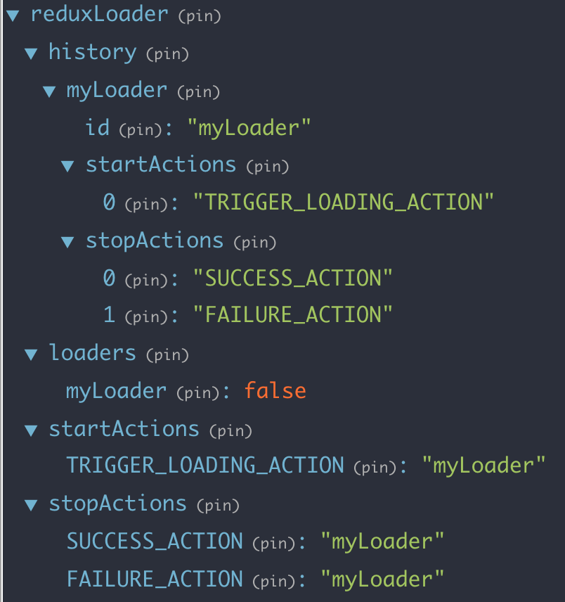

[](https://travis-ci.org/nishanbajracharya/redux-state-loader)
[](https://github.com/nishanbajracharya/redux-state-loader)


# Redux State Loader
A redux middleware to handle loading states triggered through start and stop actions.

## Why would I need this?
Ever wanted a loading indicator while you are fetching a large amount of data. Ever wanted to block a submit button from being clicked again after you have submitted a form. Then this is the solution for you. Instead of going through the hassle of maintaining loading states for your buttons and containers, `redux-state-loader` does it for you.

## Getting started
The first step is to add `redux-state-loader` into your project.

```
npm install --save redux-state-loader
```

> Note: The package itself has no dependencies but would be useless without [Redux](https://redux.js.org/).

The next step is to register the middleware in the redux store.

```js
//store.js

import { reduxLoaderReducer, reduxLoaderMiddleware } from 'redux-state-loader';
import { applyMiddleware, createStore, compose, combineReducers } from 'redux';

const loaderMiddleware = reduxLoaderMiddleware();
const enhancer = compose(applyMiddleware(loaderMiddleware));

const reducer = combineReducers({
  reduxLoader: reduxLoaderReducer,
  // other reducers
});

const store = createStore(reducer, enhancer);
```

The `reduxLoaderMiddleware` function accepts a key that should be the same as the key used to add `reduxLoaderReducer` into `combineReducers`.

```js
const loaderMiddleware = reduxLoaderMiddleware('myCustomLoader');
// Uses 'reduxLoader' by default

const reducer = combineReducers({
  myCustomLoader: reduxLoaderReducer,
  // other reducers
});
```

## Usage
Redux loader provides a bunch of actions that can be used to manage the loading states.

```js
STOP_LOADING = '@@RL/STOP_LOADING'
START_LOADING = '@@RL/START_LOADING'
REGISTER_LOADER = '@@RL/REGISTER_LOADER'
UNREGISTER_LOADER = '@@RL/UNREGISTER_LOADER'
```
> You'll only really need `REGISTER_LOADER` and `UNREGISTER_LOADER` but other actions can also be used.

Also action creators.

```js
registerLoader({
  id: String,
  stopActions: Array,
  startActions: Array
}): Action

startLoading(id: String): Action

stopLoading(id: String): Action

unregisterLoader(id: String): Action
```

Start by importing the action creators.

```js
import { reduxLoaderActions } from 'redux-state-loader';
```

Next register a loader by supplying a unique id, start actions and stop actions.

```js
const registerAction = reduxLoaderActions.registerLoader({
  id: 'myLoader',
  startActions: ['TRIGGER_LOADING_ACTION'],
  stopActions: ['SUCCESS_ACTION', 'FAILURE_ACTION'],
});

const unregisterAction = reduxLoaderActions.unregisterLoader('myLoader');

// Register a loader
store.dispatch(registerAction);
```
Your redux state will look something like this.


That's it. Now whenever a start action, eg. `TRIGGER_LOADING_ACTION` is dispatched, your registered loader, eg. `myLoader` will be set to `true`. Similarly, when either `SUCCESS_ACTION` or `FAILURE_ACTION` is dispatched, `myLoader` will be set to `false`.

You can subscribe to the loader using redux's `subscribe` method or using [react-redux](https://github.com/reactjs/react-redux).

```js
import { connect } from 'react-redux';

const Component = ({ myLoader: false }) =>
  <div>
    {/* Other elements */}
    {
      myLoader && <span>Loading...</span>
    }
  </div>;

const mapStateToProps = state => ({
  myLoader: state.reduxLoader.loaders.myLoader,
  // Other props
});

const EnhancedComponent = connect(mapStateToProps)(Component);
```

You can also manually trigger loading using `startLoading` and `stopLoading` actions.

```js
import { reduxLoaderActions } from 'redux-state-loader';

// Trigger loading of myLoader
store.dispatch(reduxLoaderActions.startLoading('myLoader'));

// Stop loading of myLoader
store.dispatch(reduxLoaderActions.stopLoading('myLoader'));
```

## Documentation
Read the docs using [this link](https://nishanbajracharya.github.io/redux-loader/).

## Contributing
To contribute, follow one of the two options:

- **Open an Issue**

  Open an issue detailing:
  1. What the issue is
  2. Steps to reproduce
  3. Possible solutions

  Note: These details are recommended but are entirely optional.

- **Send a Pull Request**

  Fork this project and send a pull request to the `master` branch.

## License
MIT
