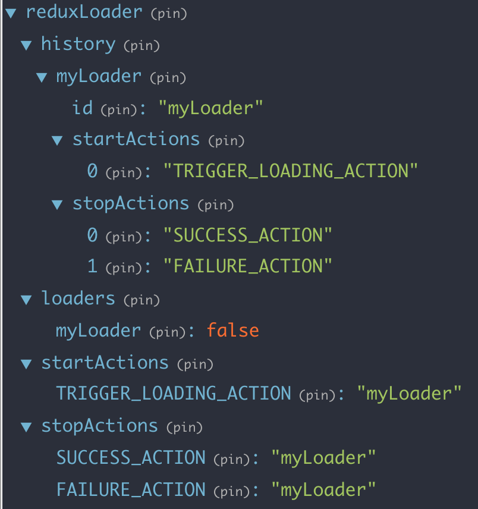

# Documentation
The document will walk you through the actions, reducer and middleware that comprises `redux-loader`.

## Actions

Importing into a project.
```js
import { reduxLoaderActions } from 'redux-loader';
```

Redux Loader provides multiple actions as follows:
```js
STOP_LOADING: '@@STOP_LOADING'
START_LOADING: '@@START_LOADING'
REGISTER_LOADER: '@@REGISTER_LOADER'
UNREGISTER_LOADER: '@@UNREGISTER_LOADER'
```

**REGISTER_LOADER**

Used to register a loader into the redux store.
```js
{
  type: '@@REGISTER_LOADER',
  payload: {
    id: 'loaderName',
    startActions: ['START_ACTION'],
    stopActions: ['SUCCESS_ACTION', 'FAILUER_ACTION']
  }
}
```

**UNREGISTER_LOADER**

Used to unregister loader from redux store.

```js
{
  type: '@@UNREGISTER_LOADER',
  payload: 'loaderName'
}
```

**START_LOADING**

Used to enable loading state.

```js
{
  type: '@@START_LOADING',
  payload: 'loaderName'
}
```

**STOP_LOADING**

Used to disable loading state.

```js
{
  type: '@@STOP_LOADING',
  payload: 'loaderName'
}
```

## Action Creators

**registerLoader**

```js
registerLoader({
  id: String,
  startActions: Array,
  stopActions: Array
})
```

Returns `@@REGISTER_LOADER`.

Example
```js
reduxLoaderActions.registerLoader({
  id: 'loaderName',
  startActions: ['START_ACTION'],
  stopActions: ['SUCCESS_ACTION', 'FAILUER_ACTION']
});
```

**unregisterLoader**

```js
unregisterLoader(id: String)
```

Returns `@@UNREGISTER_LOADER`.

Example
```js
reduxLoaderActions.unregisterLoader('loaderName');
```

**startLoading**

```js
startLoading(id: String)
```

Returns `@@START_LOADING`.

Example
```js
reduxLoaderActions.startLoading('loaderName');
```

**stopLoading**

```js
stopLoading(id: String)
```

Returns `@@STOP_LOADING`.

Example
```js
reduxLoaderActions.stopLoading('loaderName');
```

## Reducer

This section describes the redux state registered by `redux-loader`.


**history**

Stores the dispatched `@REGISTER_LOADER` action payload as is, with the id as the key.

**loaders**

Stores the loader ids as key and `bool` as values. This is the main state used to enable or disable loading values. `@@START_LOADING`, `@@STOP_LOADING`, and `@@UNREGISTER_LOADING` actions reference ids from this section.

**startActions**

Stores all the registered start action types. Each key represents the start action and value represents the loader that registered it. Values are replaced if a new loader registers the same start action.

**stopActions**

Stores all the registered stop action types. Each key represents the stop action and value represents the loader that registered it. Values are replaced if a new loader registers the same stop action.

## Middleware
In Progress
